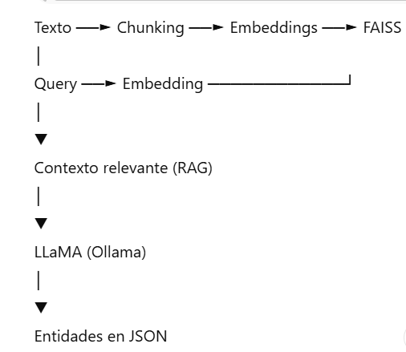
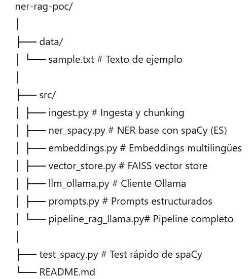

# 🧠 NER + RAG + LLaMA (PoC local en español)

Proof of Concept (PoC) para **extracción de entidades nombradas (NER)**
en español, combinando spaCy, RAG y LLaMA local.

------------------------------------------------------------------------

## 🏗️ Arquitectura



El pipeline implementa un flujo completo: 1. Ingesta y segmentación del
texto 2. Generación de embeddings semánticos 3. Recuperación de contexto
con FAISS (RAG) 4. Extracción y consolidación de entidades con LLaMA
local

------------------------------------------------------------------------

## 📂 Estructura del proyecto



Archivos principales: - `test_spacy.py`: prueba básica de NER con
spaCy - `src/`: código del pipeline RAG + LLaMA - `data/`: textos de
ejemplo

------------------------------------------------------------------------

## ⚙️ Requisitos

-   Python 3.10
-   Conda
-   VS Code
-   Ollama

------------------------------------------------------------------------

## ▶️ Ejecución

``` bash
python src/pipeline_rag_llama.py
```

------------------------------------------------------------------------

## 📤 Output esperado

``` json
{
  "PERSONA": ["Hugo Villegas"],
  "ORGANIZACION": ["YPF"],
  "FECHA": ["2024"],
  "LUGAR": [],
  "OTROS": ["spaCy", "LLaMA"]
}
```

------------------------------------------------------------------------

## 👤 Autor

**Leonardo Villegas**\
GitHub: https://github.com/Leonardorf

------------------------------------------------------------------------

> Nota: este proyecto es un PoC técnico y educativo, no optimizado para
> producción.
